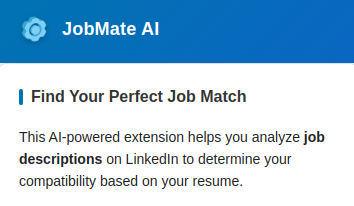
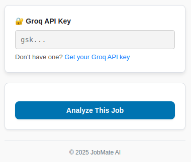
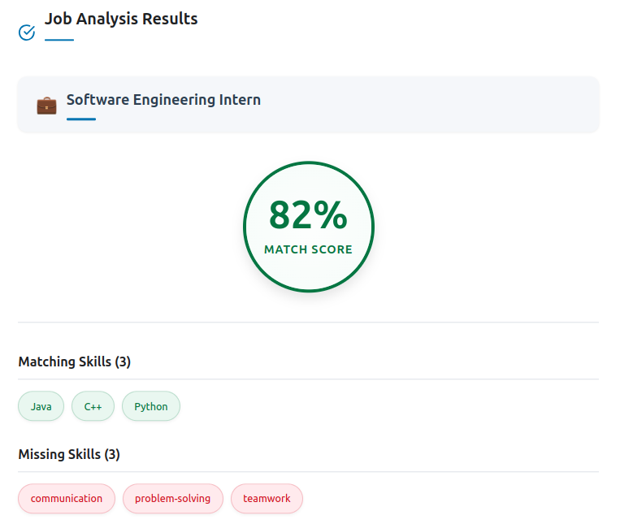

# 🧠 JobMate AI – Smart Job Assistant

> An AI-powered Chrome Extension that analyzes LinkedIn job descriptions and matches them against your uploaded resume to help you land your next job with confidence.

---

## 🚀 Demo

🎥 **Watch the demo video**  

 [View Demo Video](https://github.com/arham2211/JobMate-AI-Extension/blob/master/demo_video/demo_video.mp4?raw=true)

---

## 🔧 Features

- 🎯 One-click job description analysis directly from LinkedIn
- 📊 Get a precise matching score between your resume and the job
- 🔍 Identify matching skills you already have
- 📝 Discover missing skills you need to develop
- 🚀 Professional UI for a seamless experience
- 🔒 Privacy-focused: your API key remains in your browser

---

## 🖼️ Screenshots

### 🔹 Extension Interface

  
  
*JobMate AI extension interface on LinkedIn*

### 🔹 Analysis Results

  
*Resume matching results with skill breakdown*

---

## 🛠️ Installation (Manual)

> The extension is not currently on the Chrome Web Store. You can install it manually via GitHub.

1. **Clone this repo**
    ```bash
    git clone https://github.com/yourusername/JobMate-AI-Extension.git
    cd jobmate-extension
    ```

2. **Open Chrome** → `chrome://extensions/`

3. Enable **Developer mode**

4. Click **"Load unpacked"** → select the `JobMate-AI-Extension/` directory

5. Navigate to LinkedIn → go to any job post → click the **JobMate AI** extension icon

---

## 📦 Backend Setup (Optional for Resume Upload)

> This extension uses a FastAPI backend for resume parsing & matching. You can use the hosted version or self-host.

### Use Hosted (default):
No setup required. The extension sends requests to:

https://jobmate-ai.vercel.app

---

## 📋 Usage Guide

1. Go to any LinkedIn job listing  
2. Click the **JobMate AI** extension icon  
3. Select **"Analyze Job Description"**  
4. Upload your resume (**PDF format**)  
5. Review your results:
   - ✅ Job match score (percentage)  
   - 🧠 Skills you already have  
   - 📈 Skills you need to develop  

---

## 📄 License

This project is licensed under the **MIT License** – see the [LICENSE](LICENSE) file for details.

---

## 👨‍💻 Author

**Developed by:** Arham Affan  
**GitHub:** [@arham2211](https://github.com/arham2211)  
**Contact:** arhamaffan22@gmail.com
